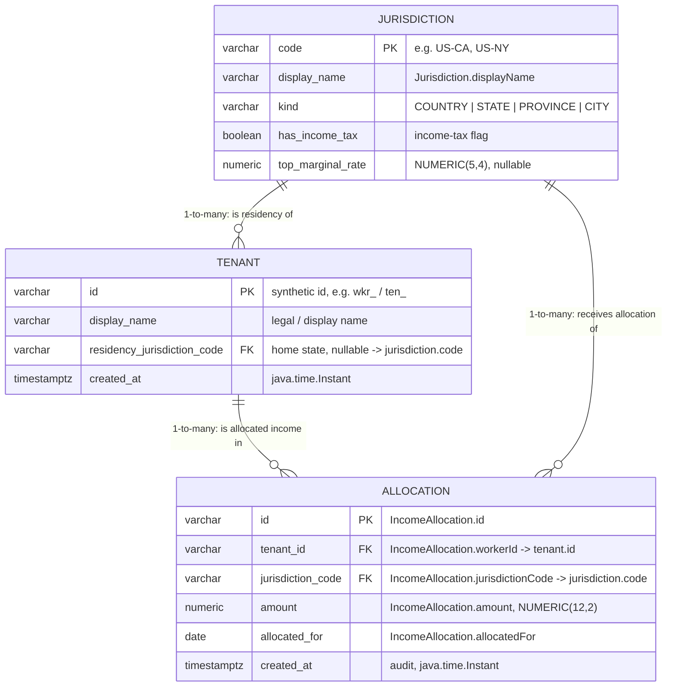

# Database — Multi-State Tax Compliance Tracker

Schema: **`multistate`**. This document sketches the three tables the capstone
needs today and maps them back to the Week 1 Java domain types so the
SQL ↔ record mapping is explicit.

- `multistate.tenant` — primary table, one row per tenant (taxpayer entity).
- `multistate.jurisdiction` — reference table of states with income-tax flags.
- `multistate.allocation` — computed allocations per tenant per jurisdiction per year.

## ER diagram



## Schema decisions

**`multistate.jurisdiction`** models the Week 1 `Jurisdiction(code, displayName,
kind)` value plus the `JurisdictionKind` enum, extended with the income-tax
flags allocation logic needs. Its invariants: the natural code is the `PRIMARY
KEY` (TEXT, `length(code) > 0`); `name` is `NOT NULL UNIQUE` so audit exports
can't be ambiguous; `kind` is `TEXT + CHECK IN ('COUNTRY','STATE','PROVINCE',
'CITY')` mirroring the enum; `top_marginal_rate` is `NUMERIC(5,4)` constrained
to `[0,1]`; and a cross-column `CHECK` (`jurisdiction_rate_consistent_with_flag`)
stops a no-income-tax jurisdiction from carrying a positive rate. It is the
reference root, so it has no outgoing FKs — instead both other tables reference
it `ON DELETE RESTRICT`, meaning a jurisdiction that is still in use cannot be
deleted out from under them.

**`multistate.tenant`** models the Week 1 "worker"/taxpayer entity that
`IncomeAllocation.workerId` points at. Its invariants: a TEXT `id` PK
(`length(id) > 0`); `display_name NOT NULL` and non-blank; `external_ref NOT
NULL UNIQUE`, the natural key from the upstream HR/payroll system, so the same
entity is never double-loaded; and `status` as `TEXT + CHECK IN
('ACTIVE','INACTIVE','SUSPENDED')`. Its one FK, `residency_jurisdiction_code →
jurisdiction(code)`, is nullable (residency may be unknown at onboarding) and
uses `ON DELETE RESTRICT` because a referenced jurisdiction is reference data,
not a child to be cascaded away.

**`multistate.allocation`** is the persisted form of a Week 1 `IncomeAllocation`,
mapping field-for-field (see the table above). Its invariants: a TEXT `id` PK
equal to `IncomeAllocation.id`; `amount NUMERIC(12,2) CHECK (amount >= 0)`, which
mirrors the record's non-negative-money invariant and keeps money exact; a
`NOT NULL` `allocated_for DATE`; and a `UNIQUE (tenant_id, jurisdiction_code,
allocated_for)` enforcing one allocation per tenant per jurisdiction per period.
Its FKs differ deliberately: `tenant_id → tenant(id)` is `ON DELETE CASCADE`
(an allocation is meaningless without its tenant — strict parent-child), while
`jurisdiction_code → jurisdiction(code)` is `ON DELETE RESTRICT` (protect the
reference table).

## Table detail

### `multistate.tenant` — primary table

One row per taxpayer entity. The Week 1 `IncomeAllocation.workerId` points here.

| Column                        | Type          | Notes                                                       |
| ----------------------------- | ------------- | ----------------------------------------------------------- |
| `id`                          | `VARCHAR`     | Prefixed synthetic id (`wkr_…` / `ten_…`) or UUID v4 string |
| `display_name`                | `VARCHAR`     | Legal / display name                                        |
| `residency_jurisdiction_code` | `VARCHAR`     | Nullable FK → `jurisdiction.code` (home/domicile state)     |
| `created_at`                  | `TIMESTAMPTZ` | Maps to `java.time.Instant`                                 |

- **Primary key:** `id`
- **Foreign keys / cardinality:** `residency_jurisdiction_code` → `jurisdiction.code`
  — **many-to-1** (many tenants share one residency jurisdiction).

### `multistate.jurisdiction` — reference table

Static reference list of taxing authorities with income-tax flags. Maps to the
Week 1 `Jurisdiction` class and `JurisdictionKind` enum.

| Column              | Type           | Notes                                                       |
| ------------------- | -------------- | ----------------------------------------------------------- |
| `code`              | `VARCHAR`      | Stable code, e.g. `US-CA` — maps to `Jurisdiction.code`     |
| `display_name`      | `VARCHAR`      | Maps to `Jurisdiction.displayName`                          |
| `kind`              | `VARCHAR`      | `COUNTRY \| STATE \| PROVINCE \| CITY` — `JurisdictionKind` |
| `has_income_tax`    | `BOOLEAN`      | Income-tax flag (e.g. `false` for TX, FL)                   |
| `top_marginal_rate` | `NUMERIC(5,4)` | Nullable; null when `has_income_tax = false`                |

- **Primary key:** `code`
- **Foreign keys:** none (this is the reference/root table).

### `multistate.allocation` — computed allocations

One row per tenant per jurisdiction per year — the persisted form of a Week 1
`IncomeAllocation`.

| Column              | Type            | Notes                                                            |
| ------------------- | --------------- | ---------------------------------------------------------------- |
| `id`     | `VARCHAR`       | Prefixed synthetic id / UUID v4 string                           |
| `tenant_id`         | `VARCHAR`       | FK → `tenant.id`                                          |
| `jurisdiction_code` | `VARCHAR`       | FK → `jurisdiction.code`                                         |
| `amount`            | `NUMERIC(12,2)` | Money: `BigDecimal`, `scale = 2`, `HALF_UP` — never `float`      |
| `allocated_for`     | `DATE`          | Maps to `java.time.LocalDate`                                    |
| `created_at`        | `TIMESTAMPTZ`   | Audit timestamp, `java.time.Instant`                             |

- **Primary key:** `id`
- **Foreign keys / cardinality:**
  - `tenant_id` → `tenant.id` — **1-to-many** (one tenant has many allocations).
  - `jurisdiction_code` → `jurisdiction.code` — **1-to-many** (one jurisdiction has many allocations).
- **Uniqueness:** `UNIQUE (tenant_id, jurisdiction_code, allocated_for)` enforces
  "one allocation per tenant per jurisdiction per period".

## Mapping back to the Week 1 `IncomeAllocation` record

`record IncomeAllocation(String id, String workerId, String jurisdictionCode,
BigDecimal amount, LocalDate allocatedFor)` maps **field-for-field** onto
`multistate.allocation`:

| Java field (`IncomeAllocation`) | Java type    | Column (`multistate.allocation`) | SQL type        |
| ------------------------------- | ------------ | -------------------------------- | --------------- |
| `id`                            | `String`     | `id` (PK)             | `VARCHAR`       |
| `workerId`                      | `String`     | `tenant_id` (FK)                 | `VARCHAR`       |
| `jurisdictionCode`              | `String`     | `jurisdiction_code` (FK)         | `VARCHAR`       |
| `amount`                        | `BigDecimal` | `amount`                         | `NUMERIC(12,2)` |
| `allocatedFor`                  | `LocalDate`  | `allocated_for`                  | `DATE`          |

`created_at` is the only `allocation` column **not** present in the record —
it is an audit-only field populated on insert.

## Local run

From a clean Postgres (server already running, e.g. `brew services start
postgresql@16`), a fresh engineer recreates the schema and seed with:

```bash
# 1. create a dedicated database (one time)
createdb -h localhost -U postgres multistate

# 2. apply the schema, then the seed (-v ON_ERROR_STOP=1 aborts on first error)
psql -h localhost -U postgres -d multistate -v ON_ERROR_STOP=1 -f db/V1__schema.sql
psql -h localhost -U postgres -d multistate -v ON_ERROR_STOP=1 -f db/V2__seed.sql

# 3. verify (3 SELECTs: a 3-table join + two GROUP BY rollups)
psql -h localhost -U postgres -d multistate -f db/verify.sql
```

The migrations are **not** idempotent (`CREATE TABLE`, not `IF NOT EXISTS`), so
to reseed from scratch, reset the schema first and re-run steps 2–3:

```bash
psql -h localhost -U postgres -d multistate -c "DROP SCHEMA multistate CASCADE;"
```

## Trade-offs

**Surrogate `id` vs composite PK on `allocation`.** The natural identity of an
allocation is the triple `(tenant_id, jurisdiction_code, allocated_for)`, which
argues for a composite primary key. I chose a single TEXT `id` PK instead, with
that triple enforced as a `UNIQUE` constraint. The deciding factor is the Week 1
`IncomeAllocation.id` field: the row must round-trip to the Java record by a
single stable identity, and a one-column key keeps joins and any future child
references simple — while the `UNIQUE` constraint still guarantees the natural
key, so I lose no integrity by demoting it from the PK.

**`TEXT + CHECK` vs native `ENUM` for `kind`/`status`.** Postgres has a real
`ENUM` type, and `kind` maps cleanly to the closed `JurisdictionKind` taxonomy.
I still chose `TEXT + CHECK (col IN (...))` because evolving an `ENUM` is a
heavyweight migration (`ALTER TYPE ... ADD VALUE` can't run inside a transaction
on older servers, and removing/reordering values is effectively impossible),
whereas changing an allowed-value set is a one-line `CHECK` swap. The same
reasoning drove the `ON DELETE` split — `CASCADE` for the strict
tenant→allocation parent-child, `RESTRICT` for the jurisdiction reference table
— trading a little delete-time friction for protection against silently
orphaning or destroying reference data.
